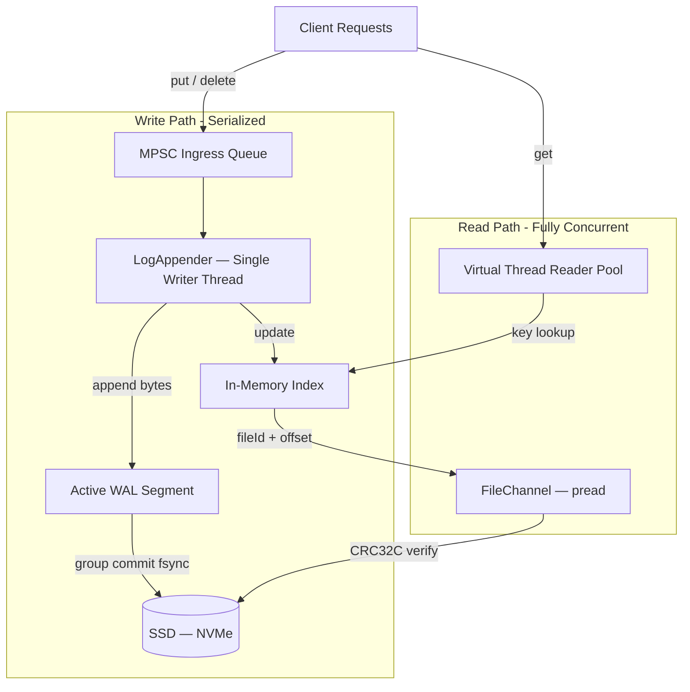

# laminar-db

> A from-scratch, embedded key-value storage engine built on the principles of **I don't like Black Boxes** — aligning software design with how hardware actually behaves.

[](https://github.com/DominiK037/laminar-db/actions/workflows/ci.yml)
[](https://openjdk.org/projects/jdk/21/)
[](LICENSE)
[](https://github.com/DominiK037/laminar-db/projects)

---

## Table of Contents

- [Why This Exists](#why-this-exists)
- [Architecture](#architecture)
- [Storage Format](#storage-format)
- [Design Decisions & Trade-offs](#design-decisions--trade-offs)
- [Performance Targets](#performance-targets)
- [Project Structure](#project-structure)
- [Getting Started](#getting-started)
- [Roadmap](#roadmap)
- [Engineering Standards](#engineering-standards)

---

## Why This Exists

Most engineers use storage engines as black boxes. This project deconstructs the black box.

`laminar-db` is a purpose-built, embedded key-value store inspired by [Bitcask](https://riak.com/assets/bitcask-intro.pdf), built to answer questions that matter in production systems:

- What happens to your data between `write()` returning `"success"` and the bits reaching NAND flash?
- Why does calling `fsync` on every write drop throughput from 100,000 ops/sec to 100?
- How does a database survive a `kill -9` mid-write without corrupting its files?
- What is the real memory cost of an in-memory index at 100 million keys?

This is not a tutorial clone. Every design decision is a deliberate trade-off, documented and defensible.

---

## Architecture

### Concurrency Model: Single-Writer, Multi-Reader

All writes are serialized through a single background thread fed by a lock-free queue. This eliminates write-lock contention entirely — the LMAX Disruptor principle applied to disk I/O.



### Write Path — Optimized for Throughput

| Step | Component | Mechanism |
|---|---|---|
| 1 | Client calls `put(key, value)` | Returns a `CompletableFuture` immediately |
| 2 | `LogTask` pushed to `LinkedBlockingQueue` | Zero-copy, no serialization yet |
| 3 | `LogAppender` drains queue in batches | Single thread, no lock contention |
| 4 | Binary `LogEntry` written to `WALSegment` | Sequential append to `FileChannel` |
| 5 | Group commit every 10ms or 16KB | `channel.force(false)` — `fdatasync` syscall |
| 6 | In-memory index updated | `ConcurrentHashMap<key, IndexEntry>` |

### Read Path — Optimized for Latency

| Step | Component | Mechanism |
|---|---|---|
| 1 | Virtual Thread receives `get(key)` | Mounted on a carrier thread |
| 2 | Index lookup | `O(1)` hash map — returns `{fileId, offset, size}` |
| 3 | Positional read | `FileChannel.read(buffer, offset)` — safe for concurrent reads |
| 4 | Integrity check | CRC32C recomputed — throws `DataCorruptionException` on mismatch |

---

## Storage Format

Every record written to disk has a **fixed 32-byte header** followed by a variable-length payload. The format is designed for CPU cache efficiency: all multi-byte fields are 64-bit aligned.

```
┌─────────────────────────────────────────────────────────────────────┐
│                        HEADER (32 bytes)                            │
├──────────┬──────┬────────────┬──────────────┬───────────┬───────────┤
│ CRC32C   │ TYPE │  RESERVED  │     LSN      │ TIMESTAMP │  KEY_SIZE │
│ (4 bytes)│(1 B) │  (3 bytes) │  (8 bytes)   │ (8 bytes) │  (4 bytes)│
│ bytes 0-3│byte 4│  bytes 5-7 │  bytes 8-15  │bytes 16-23│bytes 24-27│
├──────────┴──────┴────────────┴──────────────┴───────────┴───────────┤
│                    VAL_SIZE (4 bytes) — bytes 28-31                 │
├─────────────────────────────────────────────────────────────────────┤
│                    PAYLOAD (variable)                               │
├─────────────────────────────────────────────────────────────────────┤
│  KEY bytes (KEY_SIZE bytes)  │  VALUE bytes (VAL_SIZE bytes)        │
└─────────────────────────────────────────────────────────────────────┘
```

| Field | Size | Description |
|---|---|---|
| `CRC32C` | 4 B | Castagnoli checksum over bytes `[4 … end]`. Hardware-accelerated on x86/ARM. |
| `TYPE` | 1 B | `0x01` = PUT, `0x00` = DELETE tombstone |
| `RESERVED` | 3 B | Explicit padding — aligns `LSN` to byte offset 8 |
| `LSN` | 8 B | Log Sequence Number — monotonic, Raft-ready |
| `TIMESTAMP` | 8 B | Unix epoch millis — Last-Write-Wins conflict resolution |
| `KEY_SIZE` | 4 B | Key length in bytes. Max: 1 KB enforced at ingress |
| `VAL_SIZE` | 4 B | Value length in bytes. `0` for DELETE. Max: 10 MB |

**Endianness:** `LITTLE_ENDIAN` throughout — matches x86/ARM native byte order, eliminating byte-swap overhead on read.

**CRC Scope:** Covers `[bytes 4 … end of payload]`. Excludes itself. Computed via zero-copy buffer slice — no intermediate heap allocation.

---

## Design Decisions & Trade-offs

### Decision 1 — Storage Model: Bitcask (Hash Index)

**Chosen over:** LSM-Tree (LevelDB/RocksDB), B-Tree (InnoDB)

| Property | Bitcask | LSM-Tree | B-Tree |
|---|---|---|---|
| Write throughput | ✅ O(1) sequential | ✅ Good | ❌ Random writes |
| Read latency | ✅ O(1) single seek | ❌ Multi-level scan | ✅ Good |
| Range scans | ❌ Not supported | ✅ Sorted | ✅ Supported |
| RAM requirement | ❌ All keys in RAM | ✅ Keys on disk | ✅ Keys on disk |
| Implementation complexity | ✅ Simple | ❌ Compaction complex | ❌ Locking complex |

**The accepted debt:** Every key must fit in RAM. No range scans. This is the right trade-off for a Phase 1 system optimizing for write throughput and implementation correctness over query flexibility.

---

### Decision 2 — I/O Model: Java NIO FileChannel

**Chosen over:** Memory-Mapped Files (`mmap`), `io_uring`

- **`mmap` rejected for writes:** Page faults are unpredictable. `SIGBUS` on disk-full crashes the JVM. No control over flush ordering. Reserved for Phase 2 reads on immutable segments.
- **`io_uring` rejected:** Requires JNI/Panama bindings. Operational complexity outweighs benefit at this stage.
- **`FileChannel` chosen:** Integrates cleanly with Virtual Threads (blocking calls unmount the VT from its carrier). Battle-tested. `force(false)` maps directly to `fdatasync`.

---

### Decision 3 — Concurrency: Virtual Threads (Project Loom)

**Chosen over:** Reactive (Netty/WebFlux), Traditional thread pools

Virtual Threads allow synchronous, readable code that scales like async. The critical constraint: **no `synchronized` blocks on the I/O path** — they pin the Virtual Thread to its Carrier Thread, destroying the M:N scheduling model. `ReentrantLock` is used where locking is unavoidable.

---

### Decision 4 — Durability: Group Commit

Calling `fsync` per write caps throughput at ~100 ops/sec (fsync ≈ 10ms on NVMe). Group Commit batches writes and flushes every **10ms or 16KB**, whichever comes first.

**The acknowledged guarantee:** Data written within the last Group Commit window (≤10ms) may be lost on a hard crash. This is the explicit trade-off for ~100× throughput gain. The WAL recovery process handles truncation of any partial tail on restart.

---

## Performance Targets

> ⚠️ Benchmarks are targets for Phase 1 completion. Numbers will be updated with measured results as each phase ships.

| Operation | Target | Condition |
|---|---|---|
| Sequential write throughput | > 200,000 ops/sec | Group Commit, 1KB values, NVMe |
| Single key read latency (p50) | < 1ms | Hot OS Page Cache |
| Single key read latency (p99) | < 5ms | Cold read, 1M keys |
| Startup recovery time | < 5 seconds | 1GB WAL |
| Index memory overhead | ~60 bytes/key | On-heap `ConcurrentHashMap` |

---

## Project Structure

```
laminar-db/
├── pom.xml                          # Parent POM — dependency management
└── laminar-core/                    # The storage engine module
    └── src/
        ├── main/java/io/laminar/core/
        │   ├── WriteAheadLog.java        # Public API — the only entry point
        │   ├── config/
        │   │   └── WALConfig.java        # All limits and tunables
        │   ├── entry/
        │   │   └── LogEntry.java         # Binary format + serialization
        │   ├── segment/
        │   │   ├── WALSegment.java       # Single .log file wrapper
        │   │   └── SegmentManager.java   # File rotation + lifecycle
        │   ├── append/
        │   │   ├── LogAppender.java      # Single-writer background thread
        │   │   └── LogTask.java          # Write request unit (data + Future)
        │   ├── recovery/
        │   │   └── WalRecovery.java      # WAL replay on startup
        │   └── exception/
        │       ├── DataCorruptionException.java
        │       ├── SegmentFullException.java
        │       └── DiskFullException.java
        └── test/java/io/laminar/core/
            ├── entry/LogEntryTest.java
            ├── segment/WALSegmentTest.java
            ├── append/LogAppenderTest.java
            └── recovery/WalRecoveryTest.java
```

---

## Getting Started

### Prerequisites

- Java 21+ ([SDKMAN](https://sdkman.io/) recommended: `sdk install java 21-open`)
- Maven 3.9+

### Build

```bash
git clone https://github.com/DominiK037/laminar-db.git
cd laminar-db
mvn clean install
```

### Run Tests

```bash
# All tests
mvn test

# Specific module
mvn test -pl laminar-core

# Single test class
mvn test -pl laminar-core -Dtest=LogEntryTest
```

---

## Roadmap

### Phase 1 — The Logger (Write Path) `[ In Progress ]`

The foundation. A crash-safe, append-only Write-Ahead Log.

- `WALConfig` — hard limits and tunable constants
- `LogEntry` — binary serialization with CRC32C integrity
- `WALSegment` — `FileChannel` wrapper with rotation logic
- `LogAppender` — single-writer thread with Group Commit
- `WalRecovery` — WAL replay and corrupt tail truncation on startup
- Chaos test — `kill -9` mid-write, restart, verify zero corruption

### Phase 2 — The Indexer (Memory Architecture) `[ Planned ]`

Map every key to its disk location in O(1).

- `IndexEntry` — compact 22-byte record (fileId + offset + size + timestamp)
- `IndexManager` — `ConcurrentHashMap`-backed in-memory index
- Startup recovery — rebuild index from WAL without reading values
- Memory benchmark — measure index RAM cost at 1M, 10M, 100M keys

### Phase 3 — The Reader (Read Path) `[ Planned ]`

Sub-millisecond random access reads.

- `RandomAccessReader` — positional `FileChannel` read by offset
- CRC32C verification on every read
- `mmap` evaluation for immutable segment reads

### Phase 4 — Compaction Engine `[ Planned ]`

Reclaim disk space from overwritten and deleted keys.

- Validity ratio heuristic for segment selection
- Merge & squash algorithm — write live keys to `.compact` file
- Atomic segment swap — rename with no reader downtime
- Concurrency safety — compact while writes continue on active segment

### Phase 5 — Network Layer `[ Future ]`

- TCP server with Virtual Thread-per-connection model
- Custom length-prefixed wire protocol
- Micrometer metrics — writes/sec, p99 read latency, queue depth

### Phase 6 — Distributed Layer `[ Future ]`

- WAL shipping to follower nodes
- LSN-based replication (Raft-ready log format already in place)

---

## Engineering Standards

### Commit Convention

This project follows [Conventional Commits](https://www.conventionalcommits.org/en/v1.0.0/).

```
<type>(<scope>): <subject>

[optional body]

[optional footer]
```

**Types:**

| Type | When to use |
|---|---|
| `feat` | New functionality |
| `fix` | Bug fix |
| `test` | Adding or correcting tests |
| `docs` | Documentation only |
| `refactor` | Code change with no behaviour change |
| `perf` | Performance improvement |
| `chore` | Build, tooling, dependency updates |

### Code Standards

- **No Java Serialization.** All disk I/O uses manual byte packing via `ByteBuffer`.
- **No magic numbers.** Every constant lives in `WALConfig` with a comment explaining its value.
- **No generic exceptions.** Every throw site uses a typed exception from the `exception` package.
- **Zero allocation on hot path.** The write path reuses `ThreadLocal<ByteBuffer>` — no per-entry heap objects.
- **Every public method has a Javadoc.** The *why*, not just the *what*.

### Testing Tiers

| Tier | Tool | What it tests |
|---|---|---|
| Unit | JUnit 5 | Pure logic — serialization, CRC, header parsing |
| Integration | JUnit 5 + `@TempDir` | Real file I/O on a temp directory |
| Chaos | Custom harness | `kill -9` mid-write, restart, assert no corruption |
| Fuzz | Random byte injection | Parser must not throw `NullPointerException` on garbage input |

---

## License

MIT © [Rushikesh Khedkar](https://github.com/DominiK037)
