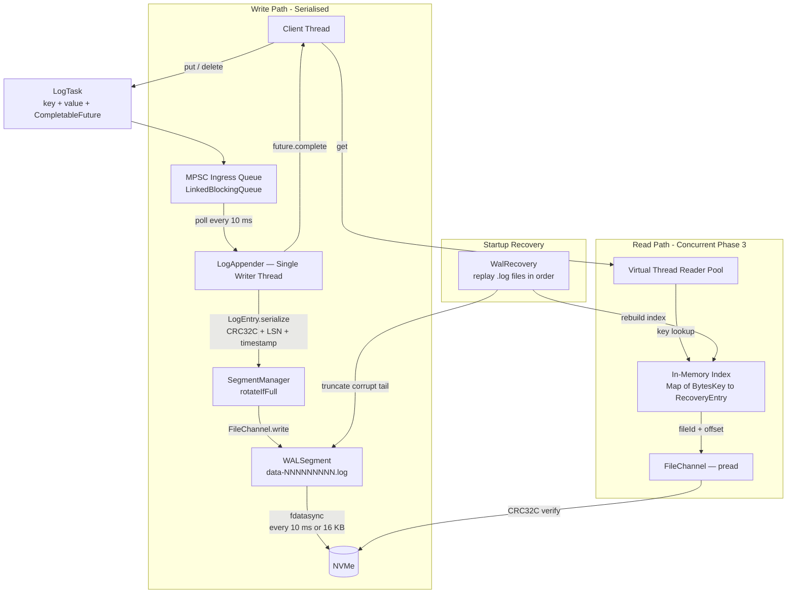
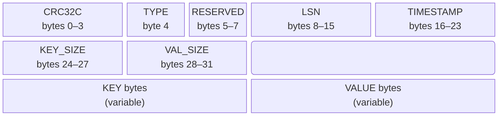

# laminar-db

A persistent, embedded key-value storage engine for the JVM, built on a
log-structured design inspired by the [Bitcask](https://riak.com/assets/bitcask-intro.pdf) paper.
Optimised for sequential write throughput and deterministic crash recovery.

[](https://github.com/DominiK037/laminar-db/actions/workflows/ci.yml)
[](https://openjdk.org/projects/jdk/21/)
[](LICENSE)

---

## What it is

laminar-db is a durable, append-only key-value store that prioritises write throughput
and crash safety. Writes are serialised through a single background thread and flushed
to disk via group commit. On restart, the engine replays its Write-Ahead Log, truncates
any corrupt tail, and rebuilds the in-memory key index — no manual recovery step required.

The engine is being built phase by phase, with every component fully tested and
documented before the next begins.

## Documentation

- [Design Document — Write-Ahead Log (Phase 1 Complete)](docs/wal-engine.md)

---

## Architecture



**Concurrency model:** Single-Writer, Multi-Reader. All writes are serialised through
`LogAppender`'s queue. Readers (Phase 3) open independent `FileChannel` instances for
concurrent positional reads with no contention on the write path.

---

## Binary Format

Every record is a fixed 32-byte header followed by a variable-length payload.
All multi-byte fields are little-endian and 64-bit aligned.



| Field | Description |
|---|---|
| `CRC32C` | Castagnoli checksum over bytes `[4 … end]`. Hardware-accelerated on x86/ARM. |
| `TYPE` | `0x01` = PUT · `0x00` = DELETE tombstone |
| `LSN` | Log Sequence Number — monotonic, Raft-compatible |
| `TIMESTAMP` | Unix epoch millis |
| `KEY_SIZE` / `VAL_SIZE` | Lengths in bytes. Key: max 64 B · Value: max 8,096 B. |

---

## Status

| Phase | Scope | Tests | Status |
|---|---|---|---|
| 1 — Write-Ahead Log | Append, group commit, crash recovery | 99 | Complete |
| 2 — Index | In-memory key index, live updates | — | Planned |
| 3 — Read Path | Point reads, CRC verification | — | Planned |
| 4 — Compaction | Reclaim disk space from deleted keys | — | Planned |

---

## Getting Started

**Prerequisites:** Java 21+, Maven 3.9+

```bash
git clone https://github.com/DominiK037/laminar-db.git
cd laminar-db
mvn clean install
```

```bash
mvn test                                          # all tests
mvn test -pl laminar-core                         # single module
mvn test -pl laminar-core -Dtest=LogEntryTest     # single class
```

---

## Contributing

### Branch naming

```
feature/<task-id>-<slug>    →  merges into phase/*
phase/<N>-<name>            →  merges into dev when phase is 100% complete
chore/<slug>                →  branches off dev, merges back to dev
docs/<slug>                 →  branches off dev, merges back to dev
fix/<slug>                  →  branches off dev, merges back to dev
```

### Code rules

- No magic numbers — every constant lives in `WALConfig` with a derivation comment
- No generic exceptions — typed exceptions from the `exception` package only
- No Java Serialization — all disk I/O uses manual `ByteBuffer` packing
- Every public method has Javadoc covering the *why*, not just the *what*
- Tests use `@Nested` classes grouped by method, `@DisplayName` on every case

---

## License

MIT © [Rushikesh Khedkar](https://github.com/DominiK037)
